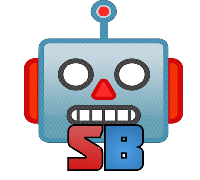

### WELCOME TO ScoutBot! A DISCORD BOT FOR VEX ROBOTEVENTS! ###

### What is this project? ###
This is a discord bot writen in python 🐍 and powered by [discord.py](https://discordpy.readthedocs.io/en/latest/api.html) and the [robotevents api](https://www.robotevents.com/api/v2) 🤖.

💻️ There are a few commands, with many more planed in the future. 💻️

Here is a list of the current commands
1. **!team** - looks for vex teams based of their number and shows statistics about them (eg. 1234D)
2. **!events** - looks for events that a team is going to/has attended for the current season
3. **!info** - displays infomation about the bot's commands
4. **!version** - says the current version of the bot
5. **!skills** - gets skills information about a team from the current season
6. **!awards** - gets award information about a team from the current season

